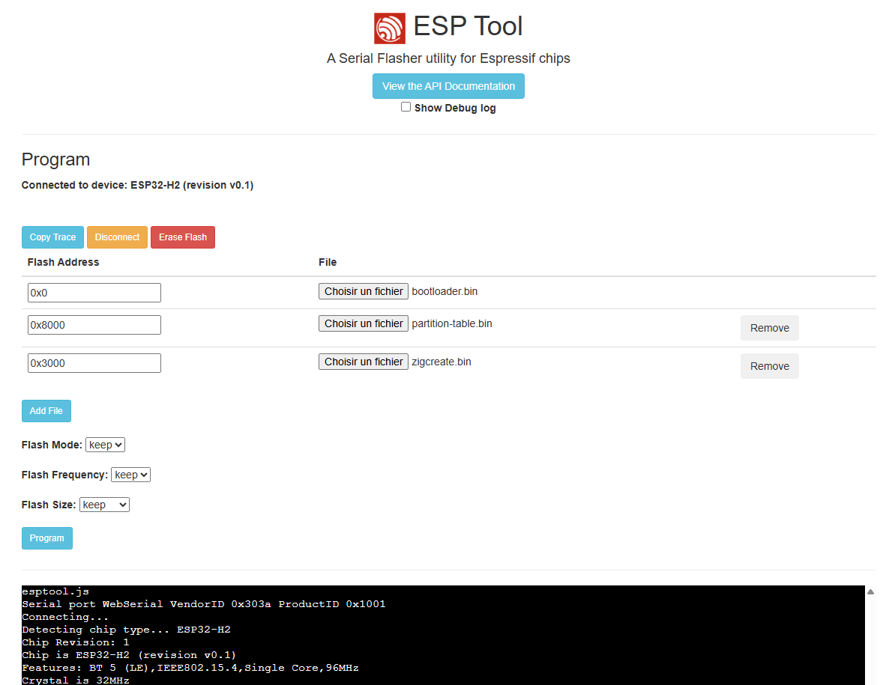

# Flasher le ZigCreate (ESP32-H2) via navigateur

Ce guide explique comment flasher le firmware **ZigCreate** sur une carte ESP32-H2 en utilisant l'outil en ligne **esptool-js**, sans installer de logiciel.

---

## Prérequis

- **Navigateur** : Google Chrome ou Microsoft Edge (WebSerial requis — Firefox non supporté)
- **Câble** : USB-C (données, pas uniquement charge)
- **Drivers** : Si votre carte utilise un chip USB-UART (CP2102, CH340…), installez le driver correspondant. Les cartes avec USB natif ESP32-H2 n'en ont pas besoin.

---

## 1. Télécharger les binaires

Rendez-vous sur la dernière release du dépôt OTA :

> **https://github.com/Pulpyyyy/zigcreate-ota/releases/latest**

Téléchargez ces trois fichiers :

| Fichier | Rôle |
|---|---|
| `bootloader.bin` | Bootloader ESP32-H2 |
| `partition-table.bin` | Table de partitions personnalisée |
| `zigcreate.bin` | Firmware applicatif |

> `zigcreate.ota` est réservé aux mises à jour Zigbee over-the-air — **ne pas utiliser ici**.

---

## 2. Passer l'ESP32-H2 en mode téléchargement (Download Mode)

1. Maintenez le bouton **BOOT** (GPIO9) enfoncé
2. Appuyez brièvement sur **RESET** (EN), puis relâchez-le
3. Relâchez le bouton **BOOT**

La carte est maintenant en mode téléchargement et attend un flash.

> Sur certaines cartes sans bouton dédié, le mode download s'active en maintenant GPIO9 à la masse au démarrage.

---

## 3. Flasher avec esptool-js

### 3.1 Ouvrir l'outil

Accédez à : **https://espressif.github.io/esptool-js/**

### 3.2 Se connecter

1. Cliquez sur **Connect**
2. Sélectionnez le port série correspondant à votre carte (ex : `COM3`, `COM8`, `/dev/ttyUSB0`)
3. Cliquez sur **Connect** dans la boîte de dialogue du navigateur

### 3.3 Configurer le flash

Dans la section **Flash Address**, renseignez les trois fichiers avec leurs adresses exactes :

| Fichier | Adresse flash |
|---|---|
| `bootloader.bin` | `0x0` |
| `partition-table.bin` | `0x8000` |
| `zigcreate.bin` | `0x30000` |

Pour ajouter un fichier supplémentaire, cliquez sur **Add File**.

> Ces adresses correspondent à la table de partitions du projet. Ne pas les modifier.

### 3.4 Paramètres

| Paramètre | Valeur |
|---|---|
| Baud rate | `9600` |
| Flash mode | `keep` |
| Flash frequency | `keep` |
| Flash size | `keep` |



### 3.5 Lancer le flash

1. Cliquez sur **Program**
2. Attendez la fin du processus (la progression s'affiche dans la console)
3. Le message `Leaving... Hard resetting via RTS pin...` indique que le flash est terminé avec succès

---

## 4. Vérification

Après le flash, la carte redémarre automatiquement sur le firmware ZigCreate. Le témoin LED doit s'allumer brièvement au démarrage (séquence d'initialisation Zigbee).

Si la carte ne redémarre pas, appuyez manuellement sur **RESET**.

---

## Résumé des adresses

```
0x00000  bootloader.bin
0x08000  partition-table.bin
0x30000  zigcreate.bin
```

---

## Dépannage

| Problème | Solution |
|---|---|
| Port non visible dans le navigateur | Vérifier le driver USB-UART, essayer un autre câble |
| Erreur de connexion | Recommencer la procédure mode téléchargement (étape 2) |
| La carte ne démarre pas après flash | Vérifier que les trois fichiers sont bien flashés aux bonnes adresses |
| `Failed to connect` | S'assurer que aucun autre programme (moniteur série, IDE) n'occupe le port |

---

## Branchement

> **Pour l'instant**, la carte doit rester alimentée via **USB**. Ne connectez pas le VCC de l'adaptateur USB-UART pour éviter tout conflit d'alimentation.
> Branchez toutefois le **GND** pour partager la masse et éviter les parasites sur les lignes série.

| Signal | Adaptateur USB-UART |
|---|---|
| VCC | — (non connecté) |
| GND | GND |
| TX (carte) | RX |
| RX (carte) | TX |
